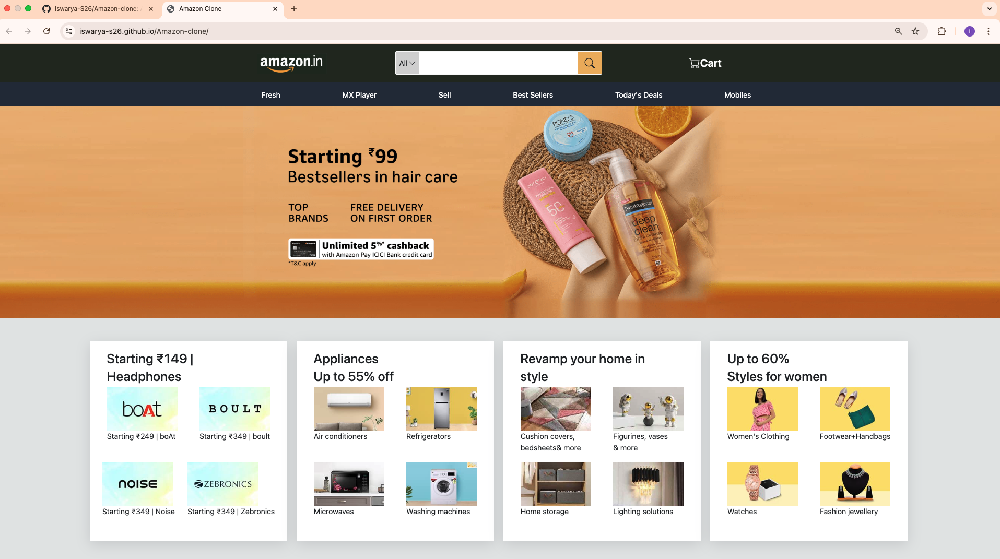

# Amazon Clone

An Amazon-inspired e-commerce webpage created as part of a frontend development practice project. The webpage is responsive and showcases a visually appealing layout with a navbar, banner, and product sections styled using Bootstrap 5 and custom CSS.

## Features

- **Responsive Design:** Ensures compatibility across different screen sizes using Bootstrap and media queries.
- **Interactive Navbar:** Includes a logo, search bar, and cart section with hover effects.
- **Dynamic Sub-navbar:** Highlights categories like Fresh, Best Sellers, and Today's Deals.
- **Banners:** Responsive banners switch between images for different screen sizes.
- **Product Sections:** Categorized products with attractive visuals and descriptions.

## Technologies Used

- **HTML5**
- **CSS3**
- **Bootstrap 5**
- **Bootstrap Icons**

## Project Structure

```
Amazon-Clone/
├── index.html         # Main HTML file
├── style.css          # Custom CSS for styling
├── images/            # Folder containing image assets
│   ├── logo1.png
│   ├── banner.png
│   ├── bannerMd.png
│   └── products/      # Product images
├── README.md          # Project documentation
```

## How to Use

1. Clone the repository:
   ```bash
   git clone https://github.com/your-username/amazon-clone.git
   ```
2. Navigate to the project directory:
   ```bash
   cd amazon-clone
   ```
3. Open `index.html` in your web browser to view the project.

## Screenshots

### Desktop View


### Mobile View


## Live Demo
[Live Demo Link](#) *(Replace with your deployed URL)*

## License

This project is licensed under the MIT License. You are free to use, modify, and distribute this project as per the terms of the license.

---

Created with ❤️ by [Iswarya Sundarrajan](https://github.com/your-username)
